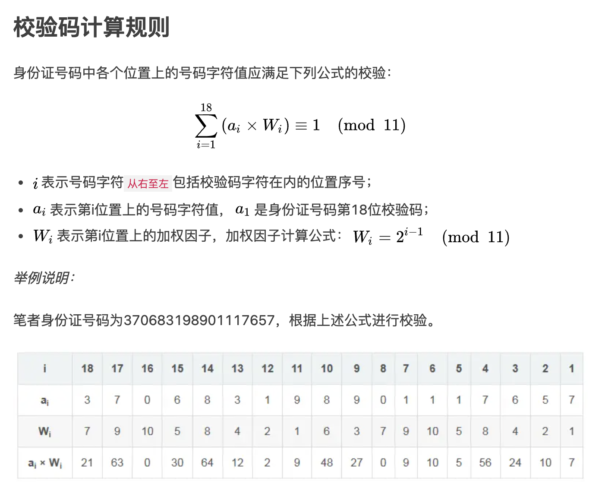

# 圆周率里第一个合法的身份证号是多少？

尽可能找可能存在的合法身份证，生日是近期的，序号部分小一些，地区存在，验证码正确。

筛选条件：第7-8位在[18, 20]中、第11-12位在[01, 12]中、第13-14位在[01, 31]中、身份证校验码正确、地区码存在（于http://www.tcmap.com.cn/list/daima_list.html中的3184个地区码中）

解题思路：
1. 圆周率数字生成器，持续输入并进行上述的关键字校验。
2. 建立校验规则，详细规则如下：
- 前六位处在地区码，需要remote api进行地区码校验。
- 第7-10位在1900-2050之间；
- 第11-14位为有效的日期格式；
- 身份证校验码正确；
    - 详细校验规则：

